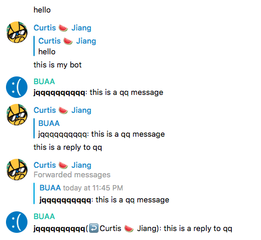
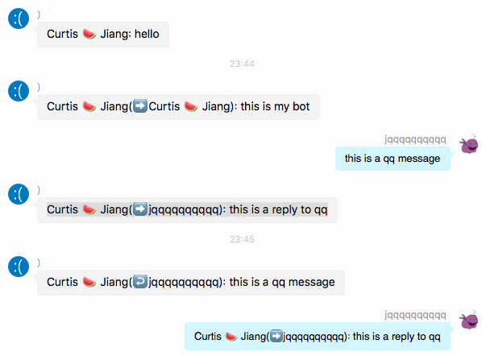
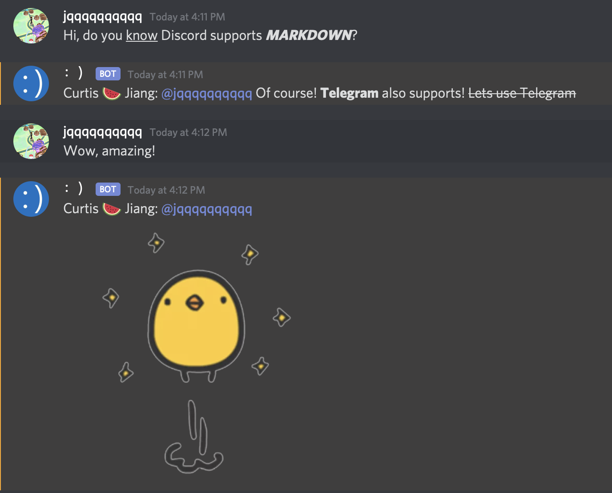
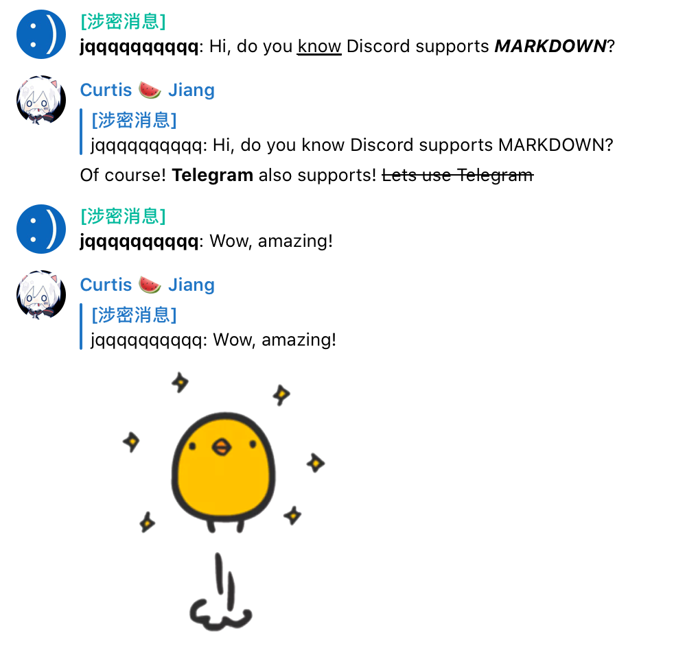

# UnifiedMessageRelay

 [](https://opensource.org/licenses/MIT)

UnifiedMessageRelay is a framework for the purpose of bringing messages from different chat platform together. With UnifiedMessageRelay,
user no longer need to view messages on different platform, or different groups. UnifiedMessageRelay brings powerful
 message forwarding functionality and flexible plugin API to meet your custom need. A driver API specification is also
 provided, so one can compose their own backend driver, and the framework will load and utilize the driver automatically.
 
## Telegram groups

[Developer group](https://t.me/s/UnifiedMessageRelayDev) 

[Support group](https://t.me/s/UnifiedMessageRelay) (Need help? Join this group)

## Demo

Telegram <-> QQ:





Telegram <-> Discord:





All four platforms: QQ, Telegram, Line and Discord can forward between each other directly.

## Supported platforms

- QQ API based on [CoolQ HTTP API](https://github.com/richardchien/coolq-http-api) [aiocqhttp](https://github.com/cqmoe/python-aiocqhttp)
- Telegram API based on [aiogram](https://aiogram.dev)
- Line API based on [linebotx](https://github.com/Shivelight/line-bot-sdk-python-extra) [linebot](https://github.com/line/line-bot-sdk-python)
- Discord API based on [Discord.py](https://github.com/Rapptz/discord.py)

## Features

- Forward text and image between all supported platforms
- Image is converted to supported format automatically
- Reply is preserved with best effort
- Markdown format is preserved for supported platforms
- Command API for customize triggers
- Message Hook API for even more customized needs

Limited support for Coolq Air. image sending is available for Coolq Pro.

## Installation

### Framework Setup
### Install python dependencies on host os

Make sure Python 3.7+ and `pip` are installed. Run:

`pip3 install -r requirements.txt`

### Install other required package on host os

`apt install libcairosvg2 ffmpeg libmagickwand-dev`

## Configurations

Create `~/.umr/`

```bash
mkdir ~/.umr
```

Copy config.yaml to `~/.umr`

[Why yaml instead of json?](https://www.quora.com/What-situation-would-you-use-YAML-instead-of-JSON-or-XML)

[Full Example config](config.yaml)

```yaml
ForwardList:
  Accounts:
    QQ: 12213312  # your QQ bot account number
    Telegram: 12321312  # your telegram bot chat id
  Topology:  # keep this key even if no topology exists
    - From: QQ
      FromChat: 1123131231
      FromChatType: group  # group, discuss, private
      To: Telegram
      ToChat: -31231212344  # telegram chat id, use !!id to show
      ToChatType: group
      ForwardType: OneWay+
      # OneWay:
      # Forward from "FromChat" to "ToChat"
      # BiDirection:
      # Forward from "FromChat" to "ToChat" and vise versa
      # OneWay+:
      # Forward from "FromChat" to "ToChat", and vise versa, ignoring backward message without "reply_to"
  Default:  # keep this key even if no default route exists
    - From: QQ
      To: Telegram
      ToChat: 123244234234
      ToChatType: group
      ForwardType: OneWay+
      # OneWay:
      # Forward from "FromChat" to "ToChat"
      # OneWay+:
      # Forward from "FromChat" to "ToChat", and vise versa, ignoring backward message without "reply_to"
Driver:
  [See each platform guide below for this section]
DataRoot: /root/coolq/data/image  # Make sure this directory exists. If you are using QQ, make sure this is pointing to coolq image directory.
CommandPrefix: "!!"
BotAdmin:
  QQ:
    - 123456789
    - 987654321
  Telegram:
    - 213442352354534534
    - 345235345345345345
```

The "QQ", "Telegram" or "Line" above are all custom names. Real bot driver should be configure throgh "Driver" list.

### Follow the guide for your platform

[QQ](Installation/QQ.md)

[Telegram](Installation/Telegram.md)

[Line](Installation/Line.md)

[Discord](Installation/Discord.md)

## Start the bot

### Viewing CLI Help

```shell
python3 daemon.py -h
```

### Background process

- Start background service

```shell
python3 daemon.py start
```

or

```shell
python3 daemon.py restart
```

By default, log will be stored in `/var/log/umr/bot.log`, and cache will be cleared out upon start.

- Stop the background service

```shell
python3 daemon.py stop
```

### Foreground process (for debugging purpose)

If you need to see the log output for debugging purpose, stop the running daemon first. Then follow this command.

```shell
python3 daemon.py run
```

Hit Ctrl + C to stop.

## Commands

### View Commands

Send `!!help` to show available commands.

### Show chat id

Send `!!id` anywhere to see chat id.

Reply message with `!!id` to reveal source chat id.

### Update QQ name list

Send `!!name` to update qq name list manually (will apply to all QQ platforms)

### Delete QQ Message

Reply to the message you want to delete with `!!del`

### add telegram blocked keyword

Message containing these keyword will not be forwarded to any other chat

Send `!!bk` and keywords separated by space

### add telegram blocked channel

Message originated from these channel will not be forwarded to any other chat

Reply forwarded channel message with `!!bc`

# Issue Format

## Check these before opening an issue

1. Check if you are using Python 3.7+
2. Check if requirements.txt is installed correctly
3. Check if binary dependencies are installed (search apt in this page)
4. (If using Coolq) Check if cq-http-api is enabled in Coolq
5. Check if the log suggests any missing configuration
6. Check if you are on Dev branch, please switch back to master

## Issues must provide

1. Descriptions about the issue
2. Logs of python3 daemon.py run (Desensitization)
3. Steps to reproduce

